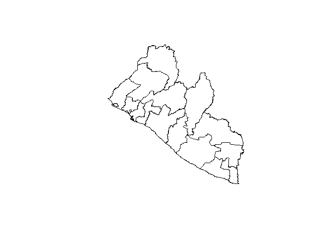

Liberia maps
================

    ## OGR data source with driver: ESRI Shapefile 
    ## Source: "C:\Users\schav\OneDrive\03 Resources\Data\Liberia-maps\lbr-administrative-divisions-shapefiles\lbr_adm_ocha_20191104_SHP\lbr_admbnda_adm1_ocha_20191104.shp", layer: "lbr_admbnda_adm1_ocha_20191104"
    ## with 15 features
    ## It has 12 fields

<!-- -->
